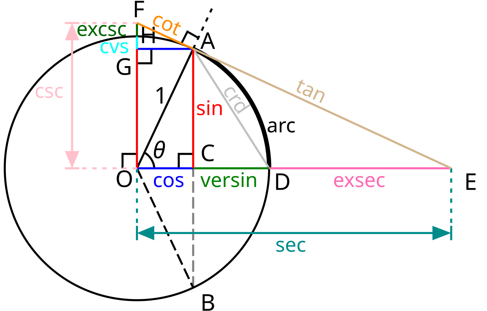

# Matematik

Jag har valt att göra en webbsida om matte för att jag tycker att det är kul.
Jag valde att skriva om allting inom matte på grundläggande nivå. Jag har en quiz som man kan testa sina kunskaper i. Jag har en sida med miniräknare och geogebra i, en sida om vem som gjorde sidan och en sida om mattens historia och varför matte är viktig. På slutet av varje sida har jag copyrights och certifikat som visar att min css är legit.

## Index

I min "index" sida har jag information om mattens historia och förklaring till varför man behöver matte. Jag har 3 boxar som visar snabb info om historian och användningen av matten i vardagslivet. Sedan kort info om varför man ska bry sig om matten. Och sist lite förlängd historia av matten.

## Grundläggande matte

I "grundläggande matte" sidan har jag information om vad enkla matte begrepp handlar om. T.ex. tal och räknesätt, bråk och procent och potenser och rötter. Grundläggande matte har olika små boxar och 3 olika fördelningar som förklarar olika grejer. I den första fördelningen skrev jag om tal och räknesätt. I andra fördelningen skrev jag om bråk och procent. I den tredje skrev jag om potenser och rötter. På början av varje uppdelning är det en liten box som kort förklarar varför det området är viktig. Resten av boxarna går in på djupet av det området.

## Omsidan

I "Omsidan" sida har jag information om vem som gjorde sidan alltså mig, varför jag gjorde sidan och vad det är för sida. Jag har en bild på trigonometri som visar att det är komplicerat men att jag kommer att förklara det på ett enkelt sätt.

## Övningar

I "Övningar" sidan har jag en quiz med 5 frågor som blir slumpmässigt valda och efter quizen ser man resultaten. Om man inte väljer ett svar kan man inte gå vidare och när man har valt ett svar kan man trycka på next. På slutet av quizen kan man börja om quizen och då resettas koden.

## Miniräknare

I "Miniräknare" sidan har jag en miniräknare och geogebra under för lättare visualisering av grafer. Miniräknaren räknar ut det man skriver in så som en vanlig miniräknare gör. Geogebra är tagen från geogebrasa sidan.

# Bevis att sidan fungerar på olika webbsökare

## Google Chrome

## Microsoft Edge

## Brave

